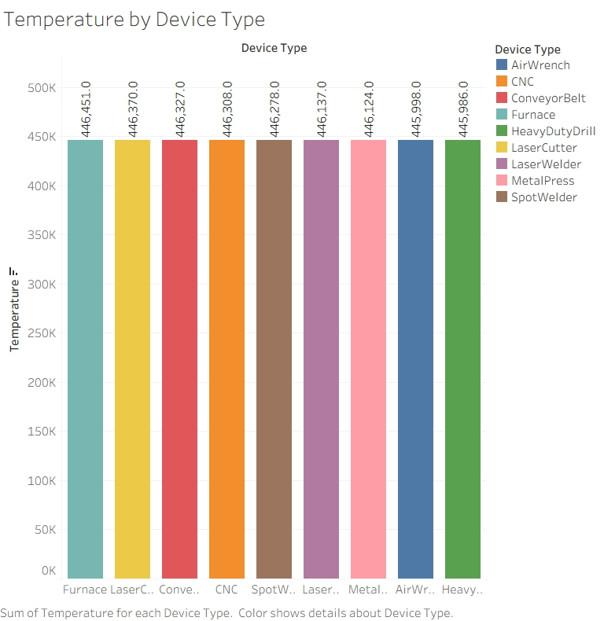
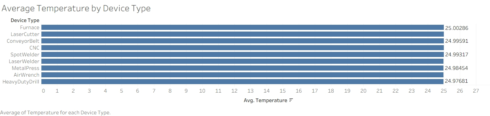
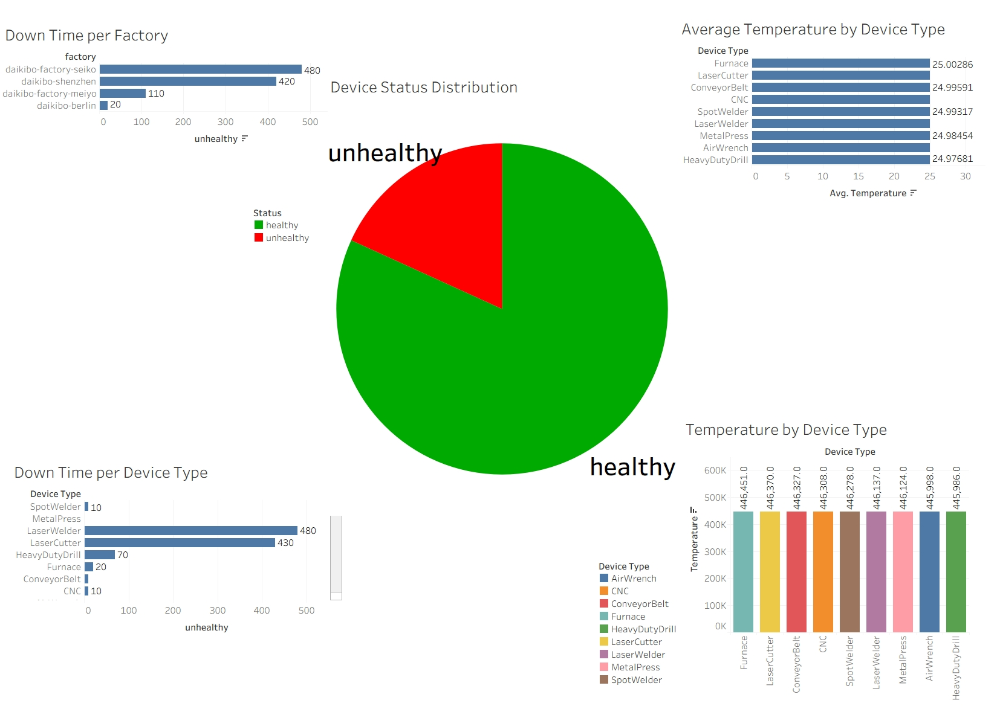
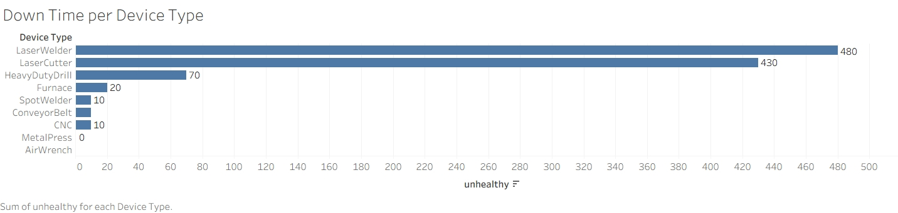
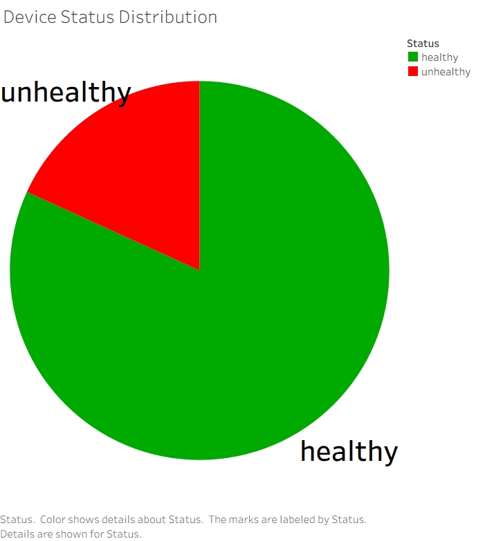
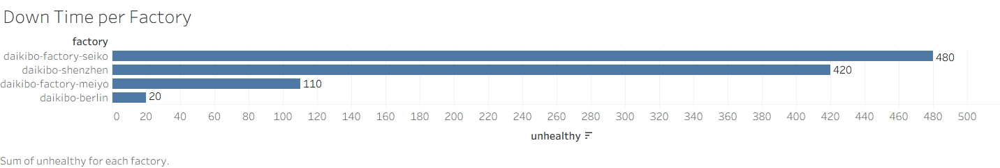

# Industrial Equipment Monitoring Dashboard

A Tableau dashboard project analyzing equipment health, downtime, and temperature performance.

## Tools
- Tableau
- Data Visualization
- Data Analytics

## Key Insights
- Most devices are healthy.
- Seiko factory has highest downtime.
- Laser devices show highest downtime.
- Temperature is stable across device types.
# Industrial Equipment Monitoring Dashboard

## Project Overview

This Tableau dashboard analyzes industrial equipment performance, device health, downtime patterns, and temperature monitoring.

## Tools Used

- Tableau
- Data Visualization
- Data Analytics
- Dashboard Design

## Key Insights

- Most devices are operating in a healthy state.
- Seiko factory recorded the highest downtime.
- Laser Welders and Laser Cutters experienced the most downtime.
- Temperature remains stable across device types.

## Dashboard Preview

### 1. Industrial Equipment Monitoring Dashboard

### 2. Device Status Distribution

### 3. Downtime Per Factory

### 4. Downtime Per Device Type

### 5. Device Status Distribution

### 6. Average Temperature By Device Type

